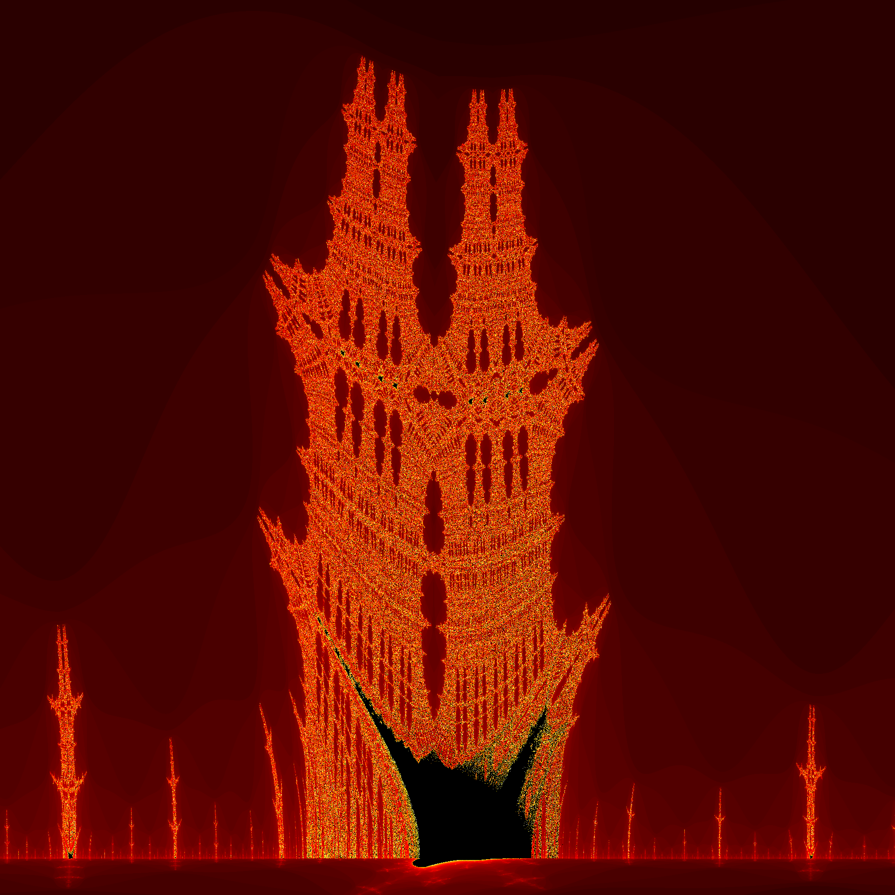
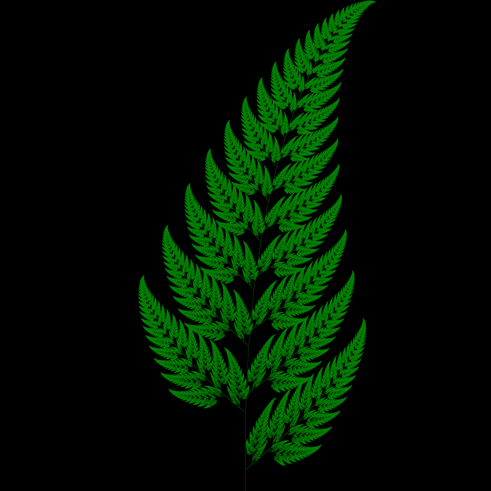
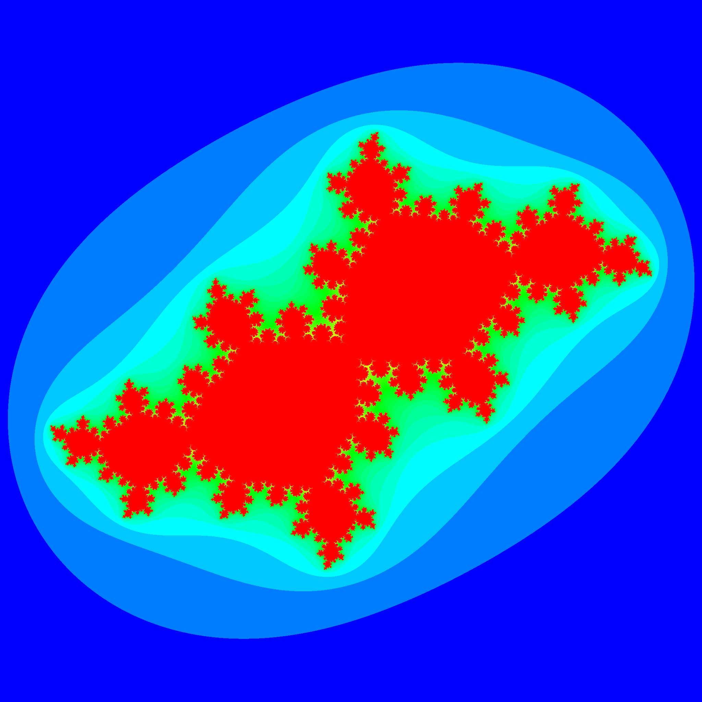
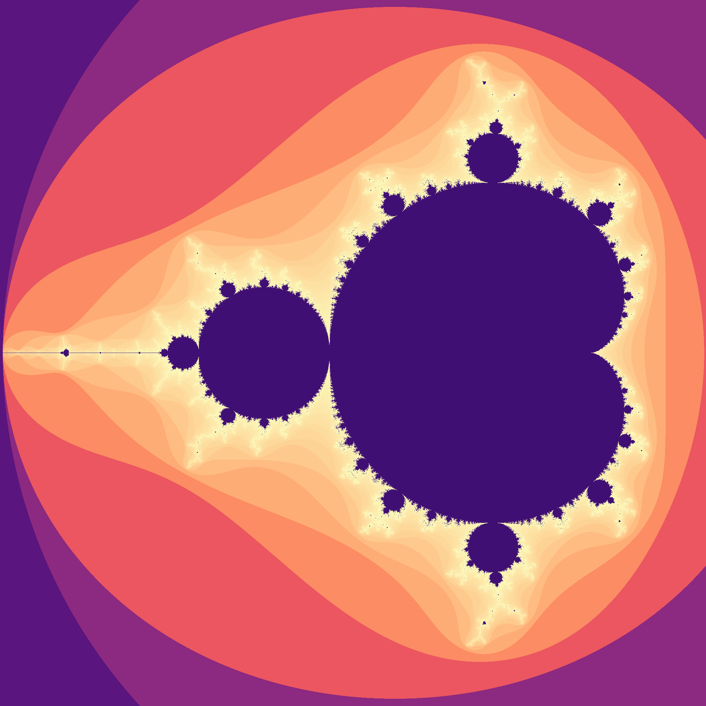
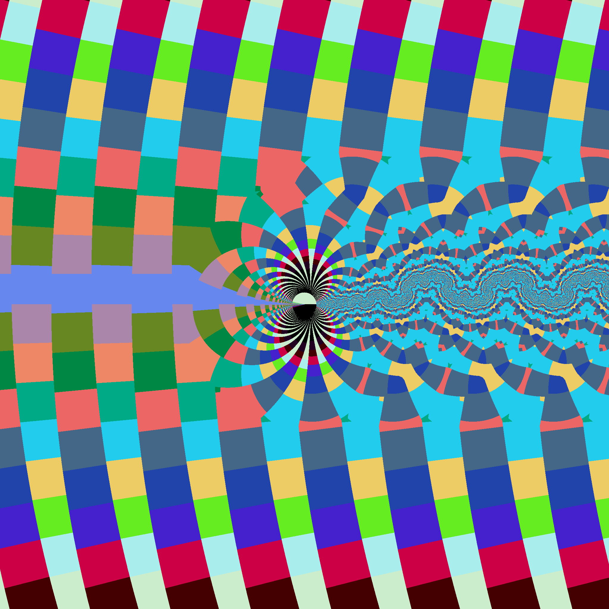
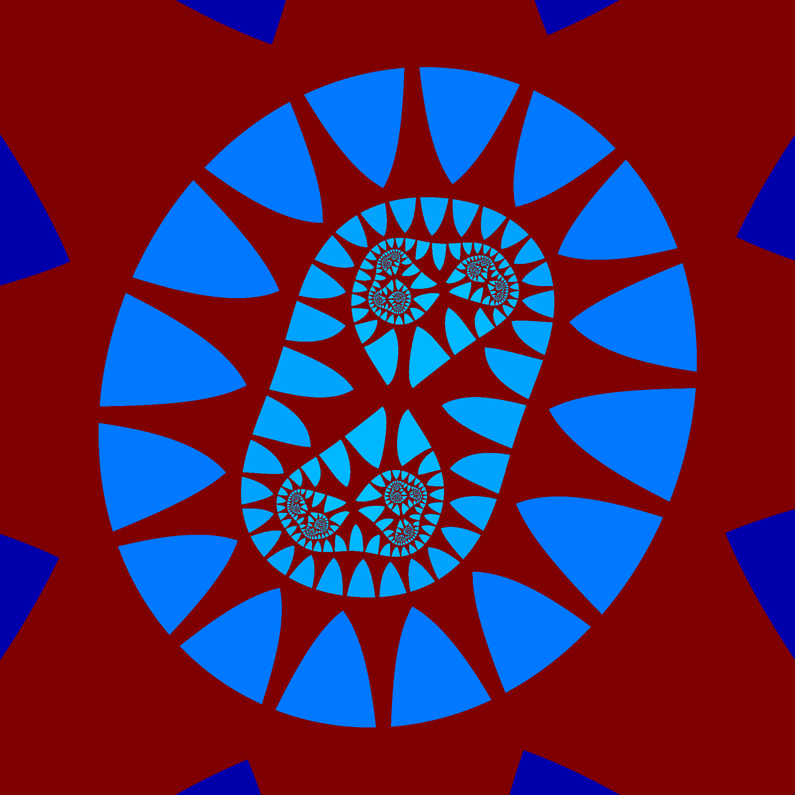

Fractal Image Generators in SDL

# GitHub Repository
[https://github.com/daelsepara/sdl-fractals](https://github.com/daelsepara/sdl-fractals)

# Building (Unix/Linux)

```cmd
cd repository/src
make
```

**Dependencies**: sdl2, sdl2-image

# Usage

```cmd
./Fractals.exe /PARAMS={parameters.json} /IMAGE={image.png} /PALETTE={palette.json} /BENCHMAK {other parameters}
```

## Required parameters

#### /PARAMS={parameters.json}

Read parameters from *{parameters.json}* file.

See [parameters/](https://github.com/daelsepara/sdl-fractals/tree/main/src/parameters/) for sample parameter files.

## Optional parameters

#### /IMAGE={image.png}
Save fractal to *{image.png}*

#### /PALETTE={palette.json}
Use *{palette.json}* colormap. See [palettes/](https://github.com/daelsepara/sdl-fractals/tree/main/src/palettes/) for some colormaps that can be used.

#### /BENCHMARK
Generate fractal in memory without rendering on the screen or saving image to {image.png}

Without **/BENCHMARK** and **/IMAGE**, the fractal is rendered on the screen.

## Other parameters

#### /INVERTX
Inverts x-axis. Left to right goes from + to - values.

#### /INVERTY
Inverts y-axis. Top to bottom goes from - to + values.

#### /INVERT
Inverts color values.

#### /LOG
Use log-scale color mapping. Overrides color mapping in parameter file.

#### /NORMALIZED
Use normalized color mapping. Overrides color mapping in parameter file.

#### /MOD
Use moduluo-255 color mapping. Overrides color mapping in parameter file.

#### /HISTOGRAM
Use histogram color mapping. Overrides color mapping in parameter file.

#### /DEFAULT
Use default color mapping. Overrides color mapping in parameter file.

# Examples

## Mandelbrot Set


### Parameters

|||
|---------------|-----------------------|
|Generator      | **z**^**exp** + **C** |
|exponent       | 2 |
|max iterations | 255 |
|orbit          | 2.0 |
|parameter files| [mandelbrot](https://github.com/daelsepara/sdl-fractals/tree/main/src/parameters/mandelbrot.json), [mandelbrot2](https://github.com/daelsepara/sdl-fractals/tree/main/src/parameters/mandelbrot2.json), [mandelbrot3](https://github.com/daelsepara/sdl-fractals/tree/main/src/parameters/mandelbrot3.json) |
|palette        | default |
|source(s)      | [Mandelbrot.hpp](https://github.com/daelsepara/sdl-fractals/tree/main/src/fractals/Mandelbrot.hpp), [Mandelbrot2.hpp](https://github.com/daelsepara/sdl-fractals/tree/main/src/fractals/Mandelbrot2.hpp), [Mandelbrot3.hpp](https://github.com/daelsepara/sdl-fractals/tree/main/src/fractals/Mandelbrot3.hpp) |

### Benchmarks

**mandelbrot**
```cmd
Time (mean ± σ):     474.8 ms ±   7.7 ms    [User: 450.3 ms, System: 17.9 ms]
Range (min … max):   460.1 ms … 484.7 ms    10 runs
```

**mandelbrot2**
```cmd
Time (mean ± σ):     382.1 ms ±   7.6 ms    [User: 359.3 ms, System: 17.4 ms]
Range (min … max):   375.8 ms … 401.5 ms    10 runs
```

**mandelbrot3**
```cmd
Time (mean ± σ):     390.9 ms ±  11.6 ms    [User: 365.0 ms, System: 18.2 ms]
Range (min … max):   376.6 ms … 411.8 ms    10 runs
```

## Newton


### Parameters

|||
|---------------|----------------------------------|
|Generator      | **z** - (**z**^3 - 1)/(3**z**^2) |
|tolerance      | 1e-6 |
|max iterations | 255 |
|parameter file | [newton1](https://github.com/daelsepara/sdl-fractals/tree/main/src/parameters/newton1.json) |
|palette        | default |
|source         | [Newton1.hpp](https://github.com/daelsepara/sdl-fractals/tree/main/src/fractals/Newton1.hpp) |

```cmd
Time (mean ± σ):     868.1 ms ±   8.0 ms    [User: 822.9 ms, System: 35.2 ms]
Range (min … max):   855.1 ms … 882.9 ms    10 runs
```

## Julia Sets

### Common Parameters

|||
|---------------|-----------------------|
|Generator      | **z**^**exp** + **C** |
|max iterations | 255 |
|orbit          | 2.0 |
|source         | [Julia.hpp](https://github.com/daelsepara/sdl-fractals/tree/main/src/fractals/Julia.hpp) |

### Specific Parameters and Benchmarks


|||
|----------|-------------|
|C         | -0.4 + 0.6i |
|parameter file| [julia1](https://github.com/daelsepara/sdl-fractals/tree/main/src/parameters/julia1.json) |
|palette   | [magma](https://github.com/daelsepara/sdl-fractals/tree/main/src/palettes/magma.json) |

```cmd
Time (mean ± σ):     821.6 ms ±   8.3 ms    [User: 770.7 ms, System: 38.7 ms]
Range (min … max):   812.3 ms … 836.7 ms    10 runs
```


|||
|----------|---------------|
|C         | -0.8 + 0.156i |
|parameter file| [julia2](https://github.com/daelsepara/sdl-fractals/tree/main/src/parameters/julia2.json) |
|palette   | [inferno](https://github.com/daelsepara/sdl-fractals/tree/main/src/palettes/inferno.json) |

```cmd
Time (mean ± σ):     936.7 ms ±  10.5 ms    [User: 881.0 ms, System: 39.5 ms]
Range (min … max):   925.1 ms … 959.9 ms    10 runs
```


|||
|----------|---------------|
|C         | 0.285 + 0.01i |
|parameter file| [julia3](https://github.com/daelsepara/sdl-fractals/tree/main/src/parameters/julia3.json) |
|palette   | [moreland](https://github.com/daelsepara/sdl-fractals/tree/main/src/palettes/moreland.json) |

```cmd
Time (mean ± σ):     732.1 ms ±  12.2 ms    [User: 678.0 ms, System: 38.8 ms]
Range (min … max):   718.5 ms … 755.8 ms    10 run
```


|||
|----------|-------------------|
|C         | -0.7269 + 0.1889i |
|parameter file| [julia4](https://github.com/daelsepara/sdl-fractals/tree/main/src/parameters/julia4.json) |
|palette   | [magma](https://github.com/daelsepara/sdl-fractals/tree/main/src/palettes/magma.json) |

```cmd
Time (mean ± σ):      1.224 s ±  0.019 s    [User: 1.166 s, System: 0.041 s]
Range (min … max):    1.201 s …  1.263 s    10 runs
```


|||
|----------|-------------------|
|C         | 0.26294324588 - 0.0024215732998i |
|max iterations | 320 |
|normalized colormap | true |
|parameter file| [julia5](https://github.com/daelsepara/sdl-fractals/tree/main/src/parameters/julia5.json) |
|palette   | inverted [jet](https://github.com/daelsepara/sdl-fractals/tree/main/src/palettes/jet.json) |

```cmd
Time (mean ± σ):      3.495 s ±  0.027 s    [User: 3.428 s, System: 0.039 s]
Range (min … max):    3.454 s …  3.544 s    10 runs
```

## Mandelbrot4


### Parameters

|||
|---------------|-----------------------|
|Generator      | **z**^**exp** + **C** |
|exponent       | 4 |
|max iterations | 255 |
|orbit          | 2.0 |
|parameter file | [mandelbrot4](https://github.com/daelsepara/sdl-fractals/tree/main/src/parameters/mandelbrot4.json) |
|palette        | default |
|source         | [Mandelbrot.hpp](https://github.com/daelsepara/sdl-fractals/tree/main/src/fractals/Mandelbrot.hpp) |

```cmd
Time (mean ± σ):      3.937 s ±  0.055 s    [User: 3.831 s, System: 0.056 s]
Range (min … max):    3.898 s …  4.063 s    10 runs
```

## Burning Ship


### Parameters

|||
|---------------|--------------------------------------|
|Generator      | (Re(**Zn**) + iIm(**Zn**))^2 + **C** |
|inverted x     | true |
|inverted y     | true |
|normalized colormap | true |
|inside color   | 0 |
|max iterations | 100 |
|orbit          | 4.0 |
|parameter file | [burningship](https://github.com/daelsepara/sdl-fractals/tree/main/src/parameters/burningship.json) |
|palette        | [hot](https://github.com/daelsepara/sdl-fractals/tree/main/src/palettes/hot.json) |
|source         | [BurningShip.hpp](https://github.com/daelsepara/sdl-fractals/tree/main/src/fractals/BurningShip.hpp) |

```cmd
Time (mean ± σ):     559.9 ms ±   4.1 ms    [User: 518.1 ms, System: 33.7 ms]
Range (min … max):   552.8 ms … 567.2 ms    10 runs
```

## Burning Ship (2)


### Parameters

|||
|---------------|--------------------------------------|
|Generator      | (Re(**Zn**) + iIm(**Zn**))^2 + **C** |
|inverted x     | true |
|inverted y     | true |
|log colormap   | true |
|inside color   | 0 |
|max iterations | 100 |
|orbit          | 4.0 |
|parameter file | [burningship2](https://github.com/daelsepara/sdl-fractals/tree/main/src/parameters/burningship2.json) |
|palette        | [plasma](https://github.com/daelsepara/sdl-fractals/tree/main/src/palettes/plasma.json) |
|source         | [BurningShip.hpp](https://github.com/daelsepara/sdl-fractals/tree/main/src/fractals/BurningShip.hpp) |

```cmd
Time (mean ± σ):      1.469 s ±  0.289 s    [User: 0.840 s, System: 0.054 s]
Range (min … max):    1.248 s …  2.128 s    10 runs
```

## Burning Ship (3)


### Parameters

|||
|---------------|--------------------------------------|
|Generator      | (Re(**Zn**) + iIm(**Zn**))^2 + **C** |
|inverted x     | true |
|inverted y     | true |
|log colormap   | true |
|inside color   | 0 |
|max iterations | 100 |
|orbit          | 4.0 |
|parameter file | [burningship3](https://github.com/daelsepara/sdl-fractals/tree/main/src/parameters/burningship2.json) |
|palette        | [bluered](https://github.com/daelsepara/sdl-fractals/tree/main/src/palettes/bluered.json) |
|source         | [BurningShip.hpp](https://github.com/daelsepara/sdl-fractals/tree/main/src/fractals/BurningShip.hpp) |

```cmd
Time (mean ± σ):      1.469 s ±  0.289 s    [User: 0.840 s, System: 0.054 s]
Range (min … max):    1.248 s …  2.128 s    10 runs
```

## Tricorn


### Parameters

|||
|---------------|------------------------------------------------------------|
|Generator      | (**z_x**^2 + **z_y**^2) - i(2 * **z_x** * **z_y**) + **C** |
|inside color   | 0 |
|max iterations | 255 |
|orbit          | 4.0 |
|parameter file | [tricorn](https://github.com/daelsepara/sdl-fractals/tree/main/src/parameters/tricorn.json) |
|palette        | [parula](https://github.com/daelsepara/sdl-fractals/tree/main/src/palettes/parula.json) |
|source         | [Tricorn.hpp](https://github.com/daelsepara/sdl-fractals/tree/main/src/fractals/Tricorn.hpp) |

```cmd
Time (mean ± σ):     575.8 ms ±  21.6 ms    [User: 528.1 ms, System: 36.5 ms]
Range (min … max):   536.0 ms … 602.0 ms    10 runs
```

## Multicorn


### Parameters

|||
|---------------|---------------------------|
|Generator      | **Z_bar**^**exp** + **C** |
|exponent       | 4 |
|inside color   | 0 |
|max iterations | 255 |
|orbit          | 2.0 |
|parameter file | [multicorn](https://github.com/daelsepara/sdl-fractals/tree/main/src/parameters/multicorn.json) |
|palette        | [viridis](https://github.com/daelsepara/sdl-fractals/tree/main/src/palettes/viridis.json) |
|source         | [Mandelbrot.hpp](https://github.com/daelsepara/sdl-fractals/tree/main/src/fractals/Mandelbrot.hpp) |

```cmd
Time (mean ± σ):      1.316 s ±  0.016 s    [User: 1.261 s, System: 0.040 s]
Range (min … max):    1.293 s …  1.346 s    10 runs
```

## Barnsley Fern


### Parameters

|||
|---------------|--------------------------------------------------------------|
|Generator (xn) | **xn** = **xx** * **x** + **xy** * **y** + **xc** (see below)|
|Generator (yn) | **yn** = **yx** * **x** + **yy** * **y** + **yc** (see below)|
|inside color   | 128 |
|max iterations | 10000000 |
|parameter file | [barnsleyfern](https://github.com/daelsepara/sdl-fractals/tree/main/src/parameters/barnsleyfern.json) |
|palette        | [green](https://github.com/daelsepara/sdl-fractals/tree/main/src/palettes/green.json) |
|source         | [IteratedFunctionSystem.hpp](https://github.com/daelsepara/sdl-fractals/tree/main/src/fractals/IteratedFunctionSystem.hpp) |

### Generator

| Probability | Transformation [ xx xy yx yy xc yc ]           |
|-------------|------------------------------------------------|
| p < 0.01    | [  0.000  0.000  0.000  0.160  0.000  0.000 ]  |
| p < 0.86    | [  0.850  0.040 -0.040  0.850  0.000  1.600 ]  |
| p < 0.93    | [  0.200 -0.260  0.230  0.220  0.000  1.600 ]  |
| p < 1.00    | [ -0.150  0.280  0.260  0.240  0.000  0.440 ]  |

```cmd
Time (mean ± σ):     664.8 ms ±   9.4 ms    [User: 621.5 ms, System: 33.5 ms]
Range (min … max):   648.1 ms … 676.3 ms    10 runs
```

## Barnsley Fern (Culcita)


### Parameters

|||
|---------------|--------------------------------------------------------------|
|Generator (xn) | **xn** = **xx** * **x** + **xy** * **y** + **xc** (see below)|
|Generator (yn) | **yn** = **yx** * **x** + **yy** * **y** + **yc** (see below)|
|inside color   | 128   |
|max iterations | 10000000 |
|parameter file | [culcita](https://github.com/daelsepara/sdl-fractals/tree/main/src/parameters/culcita.json) |
|palette        | [green](https://github.com/daelsepara/sdl-fractals/tree/main/src/palettes/green.json) |
|source         | [IteratedFunctionSystem.hpp](https://github.com/daelsepara/sdl-fractals/tree/main/src/fractals/IteratedFunctionSystem.hpp) |

### Generator

| Probability | Transformation [ xx xy yx yy xc yc ]           |
|-------------|------------------------------------------------|
| p < 0.02    | [  0.000  0.000  0.000  0.250  0.000 -0.140 ]  |
| p < 0.86    | [  0.850  0.020 -0.020  0.830  0.000  1.000 ]  |
| p < 0.93    | [  0.090 -0.280  0.300  0.110  0.000  0.600 ]  |
| p < 1.00    | [ -0.090  0.280  0.300  0.090  0.000  0.700 ]  |

```cmd
Time (mean ± σ):     637.9 ms ±  32.5 ms    [User: 583.6 ms, System: 33.9 ms]
Range (min … max):   589.1 ms … 683.9 ms    10 runs
```

## Barnsley Fern (Thelypteridaceae)


### Parameters

|||
|---------------|--------------------------------------------------------------|
|Generator (xn) | **xn** = **xx** * **x** + **xy** * **y** + **xc** (see below)|
|Generator (yn) | **yn** = **yx** * **x** + **yy** * **y** + **yc** (see below)|
|inside color   | 128 |
|max iterations | 10000000 |
|parameter file | [thelypteridaceae](https://github.com/daelsepara/sdl-fractals/tree/main/src/parameters/thelypteridaceae.json) |
|palette        | [green](https://github.com/daelsepara/sdl-fractals/tree/main/src/palettes/green.json) |
|source         | [IteratedFunctionSystem.hpp](https://github.com/daelsepara/sdl-fractals/tree/main/src/fractals/IteratedFunctionSystem.hpp) |

### Generator

| Probability | Transformation [ xx xy yx yy xc yc ]           |
|-------------|------------------------------------------------|
| p < 0.02    | [  0.000  0.000  0.000  0.250  0.000 -0.400 ]  |
| p < 0.86    | [  0.950  0.005 -0.005  0.930 -0.002  0.500 ]  |
| p < 0.93    | [  0.035 -0.200  0.160  0.040 -0.090  0.020 ]  |
| p < 1.00    | [ -0.040  0.200  0.160  0.040  0.083  0.120 ]  |

```cmd
Time (mean ± σ):     572.3 ms ±   8.5 ms    [User: 533.0 ms, System: 31.7 ms]
Range (min … max):   562.6 ms … 590.9 ms    10 runs
```

## Sierpinski Carpet


### Parameters

|||
|---------------|--------------------------------------------------------------|
|Generator (xn) | **xn** = **xx** * **x** + **xy** * **y** + **xc** (see below)|
|Generator (yn) | **yn** = **yx** * **x** + **yy** * **y** + **yc** (see below)|
|inside color   | 128 |
|max iterations | 10000000 |
|parameter file | [sierpinski-carpet](https://github.com/daelsepara/sdl-fractals/tree/main/src/parameters/sierpinski-carpet.json) |
|palette        | [sand](https://github.com/daelsepara/sdl-fractals/tree/main/src/palettes/sand.json) |
|source         | [IteratedFunctionSystem.hpp](https://github.com/daelsepara/sdl-fractals/tree/main/src/fractals/IteratedFunctionSystem.hpp) |

### Generator

| Probability | Transformation [ xx xy yx yy xc yc ]     |
|-------------|------------------------------------------|
| p < 0.125   | [  0.33  0.00  0.00  0.33 -0.66  0.66  ] |
| p < 0.250   | [  0.33  0.00  0.00  0.33  0.00  0.66  ] |
| p < 0.375   | [  0.33  0.00  0.00  0.33  0.66  0.66  ] |
| p < 0.500   | [  0.33  0.00  0.00  0.33 -0.66  0.00  ] |
| p < 0.625   | [  0.33  0.00  0.00  0.33  0.66  0.00  ] |
| p < 0.750   | [  0.33  0.00  0.00  0.33 -0.66 -0.66  ] |
| p < 0.875   | [  0.33  0.00  0.00  0.33  0.00 -0.66  ] |
| p < 1.000   | [  0.33  0.00  0.00  0.33  0.66 -0.66  ] |

```cmd
Time (mean ± σ):     429.3 ms ±  31.5 ms    [User: 402.7 ms, System: 18.1 ms]
Range (min … max):   393.0 ms … 472.3 ms    10 runs
```

## Sierpinski Triangle


### Parameters

|||
|---------------|--------------------------------------------------------------|
|Generator (xn) | **xn** = **xx** * **x** + **xy** * **y** + **xc** (see below)|
|Generator (yn) | **yn** = **yx** * **x** + **yy** * **y** + **yc** (see below)|
|inside color   | 128 |
|max iterations | 10000000 |
|parameter file | [sierpinski-triangle](https://github.com/daelsepara/sdl-fractals/tree/main/src/parameters/sierpinski-triangle.json) |
|palette        | inverted [gnpu](https://github.com/daelsepara/sdl-fractals/tree/main/src/palettes/gnpu.json) |
|source         | [IteratedFunctionSystem.hpp](https://github.com/daelsepara/sdl-fractals/tree/main/src/fractals/IteratedFunctionSystem.hpp) |

### Generator

| Probability | Transformation [ xx xy yx yy xc yc ]     |
|-------------|------------------------------------------|
| p < 0.33    | [  0.50  0.00  0.00  0.50 -0.50 -0.50  ] |
| p < 0.66    | [  0.50  0.00  0.00  0.50  0.00  0.50  ] |
| p < 1.00    | [  0.50  0.00  0.00  0.50  0.50 -0.50  ] |

```cmd
Time (mean ± σ):     377.3 ms ±  26.8 ms    [User: 353.2 ms, System: 16.8 ms]
Range (min … max):   350.7 ms … 432.0 ms    10 runs
```

# Other Examples

## Tree

**Parameters:** [tree](https://github.com/daelsepara/sdl-fractals/tree/main/src/parameters/tree.json)

## Seaweed

**Parameters:** [seaweed](https://github.com/daelsepara/sdl-fractals/tree/main/src/parameters/seaweed.json)

## Julia (Dragon)

**Parameters:** [julia-dragon](https://github.com/daelsepara/sdl-fractals/tree/main/src/parameters/julia-dragon.json)

## Julia (Siegel Disk)

**Parameters:** [julia-siegel](https://github.com/daelsepara/sdl-fractals/tree/main/src/parameters/julia-siegel.json)

## Julia (Flower)

**Parameters:** [julia-flower](https://github.com/daelsepara/sdl-fractals/tree/main/src/parameters/julia-flower.json)

## Mandelbrot (Histogram coloring)

**Parameters:** [mandelbrot-histogram](https://github.com/daelsepara/sdl-fractals/tree/main/src/parameters/mandelbrot-histogram.json)

## Chrysantemum (Julia)

**Parameters:** [chrysantemum](https://github.com/daelsepara/sdl-fractals/tree/main/src/parameters/chrysantemum.json)

## Cross Snowflakes

**Parameters:** [cross-snowflakes](https://github.com/daelsepara/sdl-fractals/tree/main/src/parameters/cross-snowflakes.json)

## Dendrite (Julia)

**Parameters:** [dendrite](https://github.com/daelsepara/sdl-fractals/tree/main/src/parameters/dendrite.json)

## EKG (Julia)

**Parameters:** [ekg](https://github.com/daelsepara/sdl-fractals/tree/main/src/parameters/ekg.json)

## Snowflakes (Julia)

**Parameters:** [julia-snowflakes](https://github.com/daelsepara/sdl-fractals/tree/main/src/parameters/julia-snowflakes.json)

## Sine (Julia)

**Parameters:** [julia-sin](https://github.com/daelsepara/sdl-fractals/tree/main/src/parameters/julia-sin.json)

## Cosine (Julia)

**Parameters:** [julia-cos](https://github.com/daelsepara/sdl-fractals/tree/main/src/parameters/julia-cos.json)

## Dragon Curve

**Parameters:** [dragon-curve](https://github.com/daelsepara/sdl-fractals/tree/main/src/parameters/dragon-curve.json)

## Julia (1/z|Conjugate)

**Parameters:** [julia-funcs](https://github.com/daelsepara/sdl-fractals/tree/main/src/parameters/julia-funcs.json)

## Koch Curve

**Parameters:** [koch](https://github.com/daelsepara/sdl-fractals/tree/main/src/parameters/koch.json)

## Koch Triangle

**Parameters:** [koch-triangle](https://github.com/daelsepara/sdl-fractals/tree/main/src/parameters/koch-triangle.json)

## Koch (Mix)

**Parameters:** [kochmix](https://github.com/daelsepara/sdl-fractals/tree/main/src/parameters/kochmix.json)

## Leaf

**Parameters:** [leaf](https://github.com/daelsepara/sdl-fractals/tree/main/src/parameters/leaf.json)

## Leaf 2

**Parameters:** [leaf2](https://github.com/daelsepara/sdl-fractals/tree/main/src/parameters/leaf2.json)

## Levy Curve

**Parameters:** [levy-curve](https://github.com/daelsepara/sdl-fractals/tree/main/src/parameters/levy-curve.json)

## Mandelbrot (Sqr|Cos)

**Parameters:** [mandelbrot-funcs](https://github.com/daelsepara/sdl-fractals/tree/main/src/parameters/mandelbrot-funcs.json)

## Mandelbrot (1/z^4)

**Parameters:** [mandelbrot-reciprocal](https://github.com/daelsepara/sdl-fractals/tree/main/src/parameters/mandelbrot-reciprocal.json)

## Maple

**Parameters:** [maple](https://github.com/daelsepara/sdl-fractals/tree/main/src/parameters/maple.json)

## Pentagon

**Parameters:** [pentagon](https://github.com/daelsepara/sdl-fractals/tree/main/src/parameters/pentagon.json)

## Mandelbrot sinh^2(z)

**Parameters:** [sinh](https://github.com/daelsepara/sdl-fractals/tree/main/src/parameters/sinh.json)

## Snowflakes

**Parameters:** [snowflakes](https://github.com/daelsepara/sdl-fractals/tree/main/src/parameters/snowflakes.json)

## Tree 2

**Parameters:** [tree2](https://github.com/daelsepara/sdl-fractals/tree/main/src/parameters/tree2.json)

# Biomorphs

## Biomorph M (Mandelbrot)

**Parameters:** [biomorph-mandelbrot](https://github.com/daelsepara/sdl-fractals/tree/main/src/parameters/biomorph-mandelbrot.json)

## Biomorph 1 (Julia)

**Parameters:** [biomorph-julia](https://github.com/daelsepara/sdl-fractals/tree/main/src/parameters/biomorph-julia.json)

## Biomorph 2 (Julia)

**Parameters:** [biomorph-julia2](https://github.com/daelsepara/sdl-fractals/tree/main/src/parameters/biomorph-julia2.json)

## Biomorph 3 (Julia)

**Parameters:** [biomorph-julia3](https://github.com/daelsepara/sdl-fractals/tree/main/src/parameters/biomorph-julia3.json)

## Biomorph 4 (Julia)

**Parameters:** [biomorph-julia3](https://github.com/daelsepara/sdl-fractals/tree/main/src/parameters/biomorph-julia4.json)

## Biomorph 5 (Julia)

**Parameters:** [biomorph-julia5](https://github.com/daelsepara/sdl-fractals/tree/main/src/parameters/biomorph-julia5.json)

## Biomorph 6 (Julia)

**Parameters:** [biomorph-julia6](https://github.com/daelsepara/sdl-fractals/tree/main/src/parameters/biomorph-julia6.json)

## Biomorph 7 (Julia)

**Parameters:** [biomorph-julia7](https://github.com/daelsepara/sdl-fractals/tree/main/src/parameters/biomorph-julia7.json)

## Biomorph 8 (Julia)

**Parameters:** [biomorph-julia8](https://github.com/daelsepara/sdl-fractals/tree/main/src/parameters/biomorph-julia8.json)
