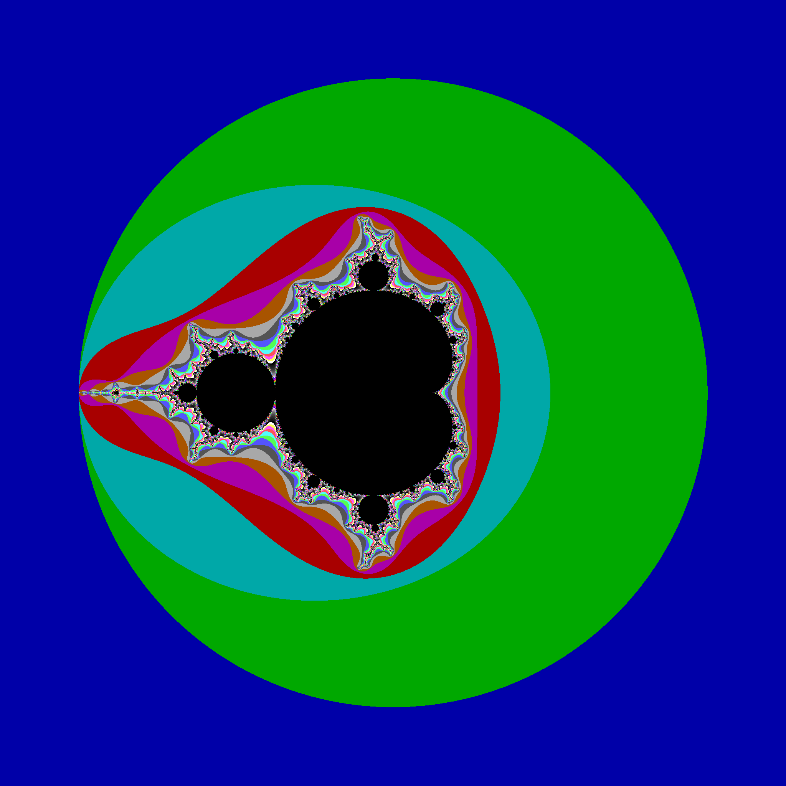

Fractal Image Generators in SDL

# Usage

```cmd
./Fractals.exe /PARAMS={parameters.json} /IMAGE={image.png} /PALETTE={palette.json} /BENCHMAK {other parameters}
```

**/IMAGE**, **/PALETTE**, and **/BENCHMARK** are optional

See [parameters/](https://github.com/daelsepara/sdl-fractals/tree/main/src/parameters/) for sample parameters.

## Optional parameters

### /IMAGE={image.png}
Save fractal to *{image.png}*

### /PALETTE={palette.json}
Use *{palette.json}* colormap. See [palettes/](https://github.com/daelsepara/sdl-fractals/tree/main/src/palettes/) for some colormaps that can be used.

### /BENCHMARK
Generate fractal in memory without rendering on the screen or saving image to {image.png}

Without **/BENCHMARK** and **/IMAGE**, the fractal is rendered on the screen.

## Other parameters

### /INVERTX
Inverts x-axis. Left to right goes from + to - values.

### /INVERTY
Inverts y-axis. Top to bottom goes from - to + values.

### /LOG
Use log-scale color mapping.

**/NORMALIZED**
Use normalized color mapping.

# Examples

## Mandelbrot Set


### Parameters

|Parameter      | Value                 |
|---------------|-----------------------|
|Generator      | **z**^**exp** + **C** |
|exponent       | 2 |
|threshold      | 255 |
|orbit          | 2.0 |
|parameter files| [mandelbrot](https://github.com/daelsepara/sdl-fractals/tree/main/src/parameters/mandelbrot.json), [mandelbrot2](https://github.com/daelsepara/sdl-fractals/tree/main/src/parameters/mandelbrot2.json), [mandelbrot3](https://github.com/daelsepara/sdl-fractals/tree/main/src/parameters/mandelbrot3.json) |
|palette        | default |
|source(s)      | [Mandelbrot.hpp](https://github.com/daelsepara/sdl-fractals/tree/main/src/fractals/Mandelbrot.hpp), [Mandelbrot2.hpp](https://github.com/daelsepara/sdl-fractals/tree/main/src/fractals/Mandelbrot2.hpp), [Mandelbrot3.hpp](https://github.com/daelsepara/sdl-fractals/tree/main/src/fractals/Mandelbrot3.hpp) |

### Benchmarks

**mandelbrot**
```cmd
Time (mean ± σ):     740.5 ms ±   6.3 ms    [User: 694.0 ms, System: 35.1 ms]
Range (min … max):   729.2 ms … 751.2 ms    10 runs
```

**mandelbrot2**
```cmd
Time (mean ± σ):     651.1 ms ±   8.4 ms    [User: 604.5 ms, System: 36.2 ms]
Range (min … max):   639.8 ms … 662.9 ms    10 runs
```

**mandelbrot3**
```cmd
Time (mean ± σ):     681.8 ms ±  35.2 ms    [User: 619.5 ms, System: 38.9 ms]
Range (min … max):   647.1 ms … 744.7 ms    10 runs
```

## Newton


### Parameters

|Parameter      | Value                            |
|---------------|----------------------------------|
|Generator      | **z** - (**z**^3 - 1)/(3**z**^2) |
|tolerance      | 1e-6 |
|threshold      | 255 |
|parameter files| [newton1](https://github.com/daelsepara/sdl-fractals/tree/main/src/parameters/newton1.json) |
|palette        | default |
|source         | [Newton1.hpp](https://github.com/daelsepara/sdl-fractals/tree/main/src/fractals/Newton1.hpp) |

```cmd
Time (mean ± σ):     868.1 ms ±   8.0 ms    [User: 822.9 ms, System: 35.2 ms]
Range (min … max):   855.1 ms … 882.9 ms    10 runs
```

## Julia Sets

### Common Parameters

|Parameter      | Value                 |
|---------------|-----------------------|
|Generator      | **z**^**exp** + **C** |
|threshold      | 255 |
|orbit          | 2.0 |
|source         | [Julia.hpp](https://github.com/daelsepara/sdl-fractals/tree/main/src/fractals/Julia.hpp) |

### Specific Parameters and Benchmarks


|Parameter | Value       |
|----------|-------------|
|C         | -0.4 + 0.6i |
|parameter file| [julia1](https://github.com/daelsepara/sdl-fractals/tree/main/src/parameters/julia1.json) |
|palette   | [plasma](https://github.com/daelsepara/sdl-fractals/tree/main/src/palettes/plasma.json) |

```cmd
Time (mean ± σ):     821.6 ms ±   8.3 ms    [User: 770.7 ms, System: 38.7 ms]
Range (min … max):   812.3 ms … 836.7 ms    10 runs
```


|Parameter | Value         |
|----------|---------------|
|C         | -0.8 + 0.156i |
|parameter file| [julia2](https://github.com/daelsepara/sdl-fractals/tree/main/src/parameters/julia2.json) |
|palette   | [inferno](https://github.com/daelsepara/sdl-fractals/tree/main/src/palettes/inferno.json) |

```cmd
Time (mean ± σ):     936.7 ms ±  10.5 ms    [User: 881.0 ms, System: 39.5 ms]
Range (min … max):   925.1 ms … 959.9 ms    10 runs
```


|Parameter | Value         |
|----------|---------------|
|C         | 0.285 + 0.01i |
|parameter file| [julia3](https://github.com/daelsepara/sdl-fractals/tree/main/src/parameters/julia3.json) |
|palette   | [moreland](https://github.com/daelsepara/sdl-fractals/tree/main/src/palettes/moreland.json) |

```cmd
Time (mean ± σ):     732.1 ms ±  12.2 ms    [User: 678.0 ms, System: 38.8 ms]
Range (min … max):   718.5 ms … 755.8 ms    10 run
```


|Parameter | Value             |
|----------|-------------------|
|C         | -0.7269 + 0.1889i |
|parameter file| [julia4](https://github.com/daelsepara/sdl-fractals/tree/main/src/parameters/julia4.json) |
|palette   | [magma](https://github.com/daelsepara/sdl-fractals/tree/main/src/palettes/magma.json) |

```cmd
Time (mean ± σ):      1.224 s ±  0.019 s    [User: 1.166 s, System: 0.041 s]
Range (min … max):    1.201 s …  1.263 s    10 runs
```

## Mandelbrot4


### Parameters

|Parameter      | Value                 |
|---------------|-----------------------|
|Generator      | **z**^**exp** + **C** |
|exponent       | 4 |
|threshold      | 255 |
|orbit          | 2.0 |
|parameter files| [mandelbrot4](https://github.com/daelsepara/sdl-fractals/tree/main/src/parameters/mandelbrot4.json) |
|palette        | default |
|source         | [Mandelbrot.hpp](https://github.com/daelsepara/sdl-fractals/tree/main/src/fractals/Mandelbrot.hpp) |

```cmd
Time (mean ± σ):      3.937 s ±  0.055 s    [User: 3.831 s, System: 0.056 s]
Range (min … max):    3.898 s …  4.063 s    10 runs
```

## Burning Ship


### Parameters

|Parameter      | Value                                |
|---------------|--------------------------------------|
|Generator      | (Re(**Zn**) + iIm(**Zn**))^2 + **C** |
|inverted x     | true |
|inverted y     | true |
|normalized colormap | true |
|inside color   | 0 |
|threshold      | 100 |
|orbit          | 4.0 |
|parameter files| [burningship](https://github.com/daelsepara/sdl-fractals/tree/main/src/parameters/burningship.json) |
|palette        | [hot](https://github.com/daelsepara/sdl-fractals/tree/main/src/palettes/hot.json) |
|source         | [BurningShip.hpp](https://github.com/daelsepara/sdl-fractals/tree/main/src/fractals/BurningShip.hpp) |

```cmd
Time (mean ± σ):     559.9 ms ±   4.1 ms    [User: 518.1 ms, System: 33.7 ms]
Range (min … max):   552.8 ms … 567.2 ms    10 runs
```

## Burning Ship (2)


### Parameters

|Parameter      | Value                                |
|---------------|--------------------------------------|
|Generator      | (Re(**Zn**) + iIm(**Zn**))^2 + **C** |
|inverted x     | true |
|inverted y     | true |
|log colormap   | true |
|inside color   | 0 |
|threshold      | 100 |
|orbit          | 4.0 |
|parameter files| [burningship2](https://github.com/daelsepara/sdl-fractals/tree/main/src/parameters/burningship2.json) |
|palette        | [plasma](https://github.com/daelsepara/sdl-fractals/tree/main/src/palettes/plasma.json) |
|source         | [BurningShip.hpp](https://github.com/daelsepara/sdl-fractals/tree/main/src/fractals/BurningShip.hpp) |

```cmd
Time (mean ± σ):      1.469 s ±  0.289 s    [User: 0.840 s, System: 0.054 s]
Range (min … max):    1.248 s …  2.128 s    10 runs
```

## Burning Ship (3)


### Parameters

|Parameter      | Value                                |
|---------------|--------------------------------------|
|Generator      | (Re(**Zn**) + iIm(**Zn**))^2 + **C** |
|inverted x     | true |
|inverted y     | true |
|log colormap   | true |
|inside color   | 0 |
|threshold      | 100 |
|orbit          | 4.0 |
|parameter files| [burningship3](https://github.com/daelsepara/sdl-fractals/tree/main/src/parameters/burningship2.json) |
|palette        | [bluered](https://github.com/daelsepara/sdl-fractals/tree/main/src/palettes/bluered.json) |
|source         | [BurningShip.hpp](https://github.com/daelsepara/sdl-fractals/tree/main/src/fractals/BurningShip.hpp) |

```cmd
Time (mean ± σ):      1.469 s ±  0.289 s    [User: 0.840 s, System: 0.054 s]
Range (min … max):    1.248 s …  2.128 s    10 runs
```

## Tricorn


### Parameters

|Parameter      | Value                                                      |
|---------------|------------------------------------------------------------|
|Generator      | (**z_x**^2 + **z_y**^2) - i(2 * **z_x** * **z_y**) + **C** |
|inside color   | 0 |
|threshold      | 255 |
|orbit          | 4.0 |
|parameter files| [tricorn](https://github.com/daelsepara/sdl-fractals/tree/main/src/parameters/tricorn.json) |
|palette        | [parula](https://github.com/daelsepara/sdl-fractals/tree/main/src/palettes/parula.json) |
|source         | [Tricorn.hpp](https://github.com/daelsepara/sdl-fractals/tree/main/src/fractals/Tricorn.hpp) |

```cmd
Time (mean ± σ):     575.8 ms ±  21.6 ms    [User: 528.1 ms, System: 36.5 ms]
Range (min … max):   536.0 ms … 602.0 ms    10 runs
```

## Multicorn


### Parameters

|Parameter      | Value                     |
|---------------|---------------------------|
|Generator      | **Z_bar**^**exp** + **C** |
|exponent       | 4 |
|inside color   | 0 |
|threshold      | 255 |
|orbit          | 4.0 |
|parameter files| [multicorn](https://github.com/daelsepara/sdl-fractals/tree/main/src/parameters/multicorn.json) |
|palette        | [viridis](https://github.com/daelsepara/sdl-fractals/tree/main/src/palettes/viridis.json) |
|source         | [Multicorn.hpp](https://github.com/daelsepara/sdl-fractals/tree/main/src/fractals/Multicorn.hpp) |

```cmd
Time (mean ± σ):      1.316 s ±  0.016 s    [User: 1.261 s, System: 0.040 s]
Range (min … max):    1.293 s …  1.346 s    10 runs
```

## Barnsley Fern


### Parameters

|Parameter      | Value     |
|---------------|-----------|
|Generator      | see below |
|inside color   | 128 |
|threshold      | 10000000 |
|parameter files| [barnsleyfern](https://github.com/daelsepara/sdl-fractals/tree/main/src/parameters/barnsleyfern.json) |
|palette        | [green](https://github.com/daelsepara/sdl-fractals/tree/main/src/palettes/green.json) |
|source         | [BarnsleyFern.hpp](https://github.com/daelsepara/sdl-fractals/tree/main/src/fractals/BarnsleyFern.hpp) |

### Generator

| Probability| Transformation (x_n)      | Transformation (y_n)            |
|------------|---------------------------|---------------------------------|
| p < 0.01   | x_n = 0.0                 | y_n = 0.16 * y                  |
| p < 0.86   | xn = 0.85 * x + 0.04 * y  | yn = -0.04 * x + 0.85 * y + 1.6 |
| p < 0.93   | xn = 0.2 * x - 0.26 * y   | yn = 0.23 * x + 0.22 * y + 1.6  |
| p < 1.00   | xn = -0.15 * x + 0.28 * y | yn = 0.26 * x + 0.24 * y + 0.44 |

```cmd
Time (mean ± σ):     664.8 ms ±   9.4 ms    [User: 621.5 ms, System: 33.5 ms]
Range (min … max):   648.1 ms … 676.3 ms    10 runs
```

## Barnsley Fern (Culcita)


### Parameters

|Generator      | (see below) |
|---------------|-------------|
|inside color   | 128   |
|threshold      | 10000000 |
|parameter files| [culcita](https://github.com/daelsepara/sdl-fractals/tree/main/src/parameters/culcita.json) |
|palette        | [green](https://github.com/daelsepara/sdl-fractals/tree/main/src/palettes/green.json) |
|source         | [BarnsleyFern.hpp](https://github.com/daelsepara/sdl-fractals/tree/main/src/fractals/BarnsleyFern.hpp) |

### Generator

| Probability| Transformation (x_n)      | Transformation (y_n)            |
|------------|---------------------------|---------------------------------|
| p < 0.02   | x_n = 0.0                 | y_n = 0.25 * y - 0.14           |
| p < 0.86   | xn = 0.85 * x + 0.02 * y  | yn = -0.02 * x + 0.83 * y + 1.0 |
| p < 0.93   | xn = 0.09 * x - 0.28 * y  | yn = 0.3 * x + 0.11 * y + 0.6   |
| p < 1.00   | xn = -0.09 * x + 0.28 * y | yn = 0.3 * x + 0.09 * y + 0.7   |

```cmd
Time (mean ± σ):     637.9 ms ±  32.5 ms    [User: 583.6 ms, System: 33.9 ms]
Range (min … max):   589.1 ms … 683.9 ms    10 runs
```

## Barnsley Fern (Thelypteridaceae)


### Parameters

|Generator      | (see below) |
|---------------|-------------|
|inside color   | 128 |
|threshold      | 10000000 |
|parameter files| [thelypteridaceae](https://github.com/daelsepara/sdl-fractals/tree/main/src/parameters/thelypteridaceae.json) |
|palette        | [green](https://github.com/daelsepara/sdl-fractals/tree/main/src/palettes/green.json) |
|source         | [BarnsleyFern.hpp](https://github.com/daelsepara/sdl-fractals/tree/main/src/fractals/BarnsleyFern.hpp) |

### Generator

| Probability| Transformation (x_n)              | Transformation (y_n)             |
|------------|-----------------------------------|----------------------------------|
| p < 0.02   | x_n = 0.0                         | y_n = 0.25 * y - 0.4             |
| p < 0.86   | xn = 0.95 * x + 0.005 * y - 0.002 | yn = -0.005 * x + 0.93 * y + 0.5 |
| p < 0.93   | xn = 0.035 * x - 0.2 * y - 0.09   | yn = 0.16 * x + 0.04 * y + 0.02  |
| p < 1.00   | xn = -0.04 * x + 0.2 * y + 0.083  | yn = 0.16 * x + 0.04 * y + 0.12  |

```cmd
Time (mean ± σ):     572.3 ms ±   8.5 ms    [User: 533.0 ms, System: 31.7 ms]
Range (min … max):   562.6 ms … 590.9 ms    10 runs
```
